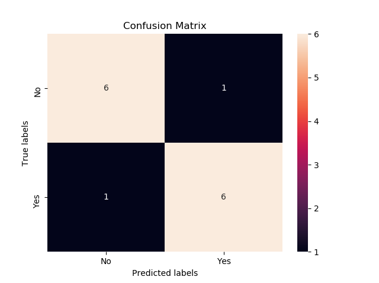
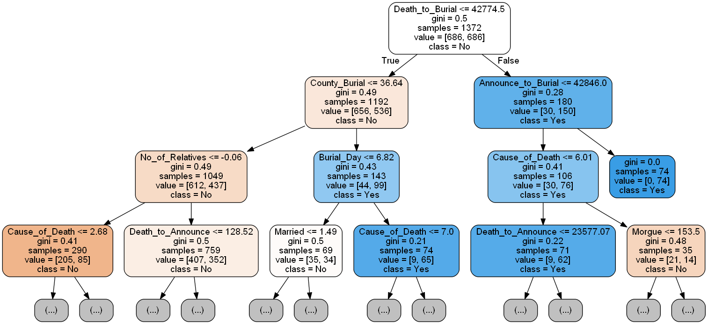

## Life Insurance Prediction Using Machine Learning

In the data folder, you will find data on mortality in Kenya.
The obituaries dataset was garthered from the Daily Nation.
You will also find a Word Document that explains the variables.

The task at hand is to use this data to inform products for life insurance as there are
several analysis that can be conducted to enable make better decisions for creating and
marketing of life insurance products.

## Kaplan-mier Survival Curve

The first thing that you should notice is that the Kaplan-Meier estimate is a continous
function. The line represents the probability that an individual is still alive after a
given time t. For example, when t=40, the probability that an individual is still alive after
that point is about 85%.

## Prediction of deaths that are likely to need fundraising
The task was carried out in Python.

After loading the data set, simple EDA was carried to familiarize ones self with  the data set.
Then identification of features and targets followed.
Categorical variables in the dataset were then encoded and all cases with missing values for
Fundraiser variable(the target variable) were dropped. These cases can be used as test cases.

As is the norm, the dataset was split in training and test sets in the ratio 99:1 as the
dataset size was small.

On fitting the model, the training accuracy was 82.51% while the test accuracy was 85.71%

Both sensitvity and specificity was 0.86. The F1-Score for both Negative Class (No) and
positive class (Yes) was also 0.86.

Note that in binary classification,
*	recall of the positive class is also known as “sensitivity”;
*	recall of the negative class is “specificity”.

### Confusion Matrix

### Sample Estimator

The time period between death and burial is signicant in determining whether a particular
family is asking for a fundraiser.

The county where one will be burried also weighs in on whether individuals from that region
will seek a fundraiser.

The objective was to determine whether an obituary will explicitly request for fund raising
(yes/no). This translates to a binary classification task.

Different classification algotithms could be employed. In this case, a Random Forest Classifier
was used to predict deaths that are likely to need fundraising. The main advantage been that it,
is an ensembe algorithmn.

## Observations
The class distribution was not equal. 60% of the cases belong to the positive class (Yes) while
39% beloged to the negative class (No).

Sub-sampling of the minimum class using SMOTE algorithm was carried out to ensure that the
model is not only predictive of the majority class.
